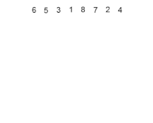

## Quick Sort
Um pivô e escolhido e todos os itens são comparados com esse pivô, os menores são realocados para a esquerda do pivô e os maiores à direita.   
Após comparar todos se escolhe um novo pivô e repete o processo até que esteja completa a ordenação;
no pior caso possui complexidade O(n²).

## Merge Sort
Divide o vetor de n itens até que não seja mais possivel - ou seja até que tenhamos n vetores.
Faz a comparação do menor valor e remonta o vetor original ordenado   
Não possui melhor/pior caso, o tempo será sempre o mesmo: O(n log2 n) 

## HeapSort
Pode ser heap maxima ou minimo. No maximo a raíz é  maior valor. No min a raíz é o menor.    
Coloca os valores a serem ordenados em uma árvore binária.
Compara o nó filho com o pai, caso o filho seja maior que o pai troca de lugar.
se uma troca for feita o pai será comparado com o seu prórpio pai.   
Não possui melhor/pior caso, o tempo será sempre o mesmo: O(n log n) 

### Principais diferenças
Enquanto no merge sort existe a obrigatóriedade de se dividir o vetor, no quick sort essa limitação não existe;   
O merge sort tem um tempo de execução fixo não importando quantas movimentações sejam necessárias, já no quicksort o tempo de execução depende da quantidade de movimentos necesśarios para a organização;   
Quicksort é o mais eficiente em volumes pequenos de dados.   
O Heapsort também possui tempo de execução estável.