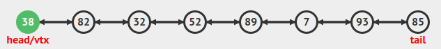
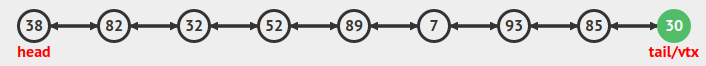

#### 1) Defina cada uma das estruturas de dados abaixo, descreva quais são as operações aplicáveis e simule cada uma das estruturas para um conjunto entrada com 10 elementos

 - Lista 
   - lista em que a ordem é definida por seus elementos, um item da lista aponta para o próximo   
      
   >removeInicio();   
      
      
   
    >removeFim();   
       
       
       
    
    >removeQualquer(3)   
       
       
       
    
    >insereQualquer(95, 4)   
       
       
       
       
    ---
 - Pilha
   - estrutura de dados que segue a ordem LIFO ultimo a entrar é o primeiro a sair   
      
   >push(7)   
   
   
   

   >pop()   
   
   
   
   ---
 - Fila de Prioridades
   - estrutura de dados que segue a ordem FIFO primeiro que entra é o primeiro que sai   
      
   >dequeue()   
      
      
      

   >enqueue(57)   
      
      
      
   ---
 - Fila Circular
   - igual a fila de prioridade porém o ultimo elemento aponta para o primeiro   
   
   
   >dequeue()   
   
   
   >dequeue()   
   
   
   >enqueue(4)   
   
   
   >enqueue(42)   
   
   
   ---
 - Lista Duplamete Ligada
   - Lista ligada em que além de um elemento apontar para o próximo também aponta para o anterior   
      
   
   >removeInicio()   
    
    
   
   >removeFim()   
    
    
    

    >removeQualquer(6)   
    
    
    
    
    >insereInicio(38)   
    
    
    
    
    
    
    >insereQualquer(25, 3)   
    
    
    
    
    
    
    
    
    
    
    
    ---
 - Árvore Binária
   - estrutura de dados não linear, bidimensional com propriedades especiais. Utiizada para representar um conjunto de dados de maneira hierárquica
   
   
   remove(52)   
   
   
   
   remove(82)   
   
   
   
   
   
   add(1)   
   
   
   add(88)   
   
   ---   
 - Grafos
   - Abstração que permite codificar relacionamentos entre pares de objetos emque os objetos são os vertices do grafo e seus relacionamentos são as arestas

#### 2)  Dada a estrutura abaixo da classe NO, realize a implementação de um método recursivo que adicione um Curso no final da Lista Duplamente Encadeada e um método **recursivo** que remova e retorne um Curso do final da Lista Duplamente Encadeada. Os métodos não devem ter nenhuma iteração, somente chamadas recursivas. A classe Curso possuí os atributos id, nome, semestre e duração
 ```Java
public class NO{
    public Curso dados;
    public NO prox;
    public NO anterior;

    public NO (Curso curso) {
        dados = curso;
        prox = null;
        anterior = null;   
    }
}
```

```Java
package atividade5.exercicio2;

public class Curso {
    private int id;
    private String nome;
    private int semestre;
    private int duracao;

    public Curso() {
    }   

    public Curso(int id, String nome, int semestre, int duracao){
        this.id = id;
        this.nome =nome;
        this.semestre = semestre;
        this.duracao = duracao ;
    }

    public int getId() {
        return id;
    }

    public void setId(int id) {
        this.id = id;
    }

    public String getNome() {
        return nome;
    }

    public void setNome(String nome) {
        this.nome = nome;
    }

    public int getSemestres() {
        return semestres;
    }

    public void setSemestres(int semestres) {
        this.semestres = semestres;
    }

    public int getDuracao() {
        return duracao;
    }

    public void setDuracao(int duracao) {
        this.duracao = duracao;
    }
}

package atividade5.exercicio2;

public class ListaDinamicaDuplaRecursiva {

    private NO inicio;
    private int tamanho;
    private NO fim;

    public int getTamanho() {
        return tamanho;
    }

    public ListaDinamicaDuplaRecursiva() {
        this.inicio = null;
        this.tamanho = 0;
    }

    public boolean listaVazia() {
        return tamanho == 0;
    }

    private NO buscarUltimo(NO aux) {
        if (aux.getProximo() != null) {
            return buscarUltimo(aux.getProximo());
        }
        return aux;
    }

    public NO inserirFinal(Curso curso) {
        NO novo = new NO(curso);
        fim = novo;
        
        NO aux = buscarUltimo(inicio);
        fim.setAnterior(aux);
        aux.setProximo(fim);
        tamanho++;
        return fim;
    }

    public NO removerFinal() {

        if (listaVazia()) {
            throw new IllegalArgumentException("Lista Vazia");
        }

        NO aux = buscarUltimo(inicio);
        fim = aux;
        aux.getAnterior().setProximo(null);
        tamanho--;
        return fim;
    }

}
``` 


#### 3) Considerando o algoritmo Quick Sort simule a sua execução para o seguinte domínio de entrada:
 > [11, 12, 8, 9, 14, 17, 22, 75, 44, 98, 120, 200, 138, 139, 22, 33, 85, 92, 35]
 #### escolhendo como pivô o elemento central


#### 4) Dado o algoritmo Merge Sort simule a sua execução para o seguinte domínio de entrada: 
> [13, 11, 7, 8, 9, 130, 129, 128, 35, 33, 200, 99, 98, 82, 83, 81, 230, 228]


#### 5) Explique o funcionamento dos algoritmos de ordenação Quick Sort, Merge Sort e Heap Sort, detalhe as principais diferenças entre os três algoritmos de ordenação. Explique o funcionamento dos métodos abaixo e qual algoritmo de ordenação eles pertencem

 ###### Quick Sort  
 > Um pivô e escolhido e todos os itens são comparados com esse pivô, os menores são realocados para a esquerda do pivô e os maiores à direita.
Após comparar todos se escolhe um novo pivô e repete o processo até que esteja completa a ordenação; no pior caso possui complexidade O(n²).  
  ######  Merge Sort
 > Divide o vetor de n itens até que não seja mais possivel - ou seja até que tenhamos n vetores. Faz a comparação do menor valor e remonta o vetor original ordenado
Não possui melhor/pior caso, o tempo será sempre o mesmo: O(n log2 n)
  ######  Heap Sort
 > Pode ser heap maxima ou minimo. No maximo a raíz é maior valor. No min a raíz é o menor.
Coloca os valores a serem ordenados em uma árvore binária. Compara o nó filho com o pai, caso o filho seja maior que o pai troca de lugar. se uma troca for feita o pai será comparado com o seu prórpio pai.
Não possui melhor/pior caso, o tempo será sempre o mesmo: O(n log n)
  ######  Principais Diferenças
 > Enquanto no merge sort existe a obrigatóriedade de se dividir o vetor, no quick sort essa limitação não existe;
O merge sort tem um tempo de execução fixo não importando quantas movimentações sejam necessárias, já no quicksort o tempo de execução depende da quantidade de movimentos necesśarios para a organização;
Quicksort é o mais eficiente em volumes pequenos de dados.
O Heapsort também possui tempo de execução estável.
  ######  ordenaA
 ```Java
 public static void ordenaAint lista- [], int inicio, int fim){
     if (inicio < fim){
         int meio = (inicio+fim) / 2;
         ordenaA(lista,inicio,meio);
         ordenaA(lista, meio+1, fim);
         ordenaB(lista, inicio, meio, meio+1, fim);
     }
 }
 ```
 > Recursivamente divide um vetor no meio até que o inicio seja igual ou maior que o fim. e envia para o metodo ordenaB.
  ######  ordenaB
 ```Java
 public static void ordenaB (int lista- [], int inicioA, int fimA, int inicioB, int fimB){
     int i1 = inicioA;
     int i2 = inicioB;
     int iaux = inicioA;
     int aux- [] = new int- [lista.length];
     while (i1 <= fimA && i2 <= fimB){
         if (lista- [i1] <= lista- [i2])
            aux- [iaux++] = lista- [i1++]
        else
            aux- [iaux++] = lista- [i2++];
     }
     while (i1 <= fimA)
        aux- [iaux++] = lista- [i1++];
    while (i2<=fimB)
        aux- [iaux++] = lista- [i2++];
    for (int i = inicioA; i<=fimB; i++){
        lista- [i] = aux- [i];
    }
 }
 ```
 > Método responsável pela ordenação e recriação do vetor separado pelo método merveSortRecursivo. Cria variáveis auxiliares para iterar no vetor e um vetor auxiliar que irá receber o vetor ordenado. O primeiro while vai ser executado até que se percorra todo o vetor pelos 2 lados - inicio ao meio e meio+1 ao fim;
compara o vetor nos dois inicios e adiciona o menor valor no vetor auxiliar na posição seguinte ao inicioA o valor do vetor na posição seguinte ao i1 ou i2, a depender de quem for menor.
O segundo e terceiro while vai copiar o vetor recebido para o vetor auxiliar.
o for no final irá remontar o vetor completo.

#### 6)  Com base no conceito de árvores binárias realize cada um dos exercícios abaixo
##### a) Simule todos os passos até o estado final da árvore binária para osseguintes elementos: 
> 25, 5, 30, 8, 20, 31, 3, 99, 88, 77, 66


 
##### b) Dada a árvore binária abaixo, apresente o estado final da árvore ao realizar a remoção do Nó raiz


##### c) Apresente os resultados das consultas dos Nós da árvore binária em préordem e pós-ordem, respectivamente
- pré-ordem
> 12,4,2,8,16
- pós-ordem
> 2,6,8,4,16,12

#### 7) Dadas as afirmações, assinale a alternativa que contém, de cima para baixo, a sequência correta, assinalando **V** para verdadeiro e **F** para falso. **Justifique a resposta**
>resposta C
 ##### A disciplina de acesso da estrutura de dados Pilha determina que o último elemento inserido no conjunto deva ser o primeiro a ser removido. 
  - Verdadeiro, pilha trabalha com um algoritimo lifo onde o ultimo elemento a ser adicionado é o primeiro elemento a ser removido; 
  ##### A implementação de lista utilizando alocação sequencial dos elementos, comparada à alocação encadeada, necessita de mais espaço de armazenamento por elemento do conjunto.
 - Falso, comparando a mesma quantidade de elementos usando lista com alocação sequencial não vai ocupar mais espaço que em uma alocação encadeada;
 ##### A pesquisa sequencial é mais eficiente que a pesquisa binária para busca de elementos em listas ordenadas implementadas com alocação sequencial dos elementos. 
 - Falso. A pesquisa sequêncial só é mais rápida em casos específicos de o item a ser encontrado estar logo no inicio da lista como não se tem a posição do item buscado devemos comparar o pior caso e no pior caso a busca binária é Θ(log2 n) enquanto a busca sequêncial é O(n).
 ##### As estruturas de dados Pilha e Fila podem ser implementadas utilizando tanto abordagens baseadas na alocação sequencial quanto na alocação encadeada dos elementos. 
 - Verdadeiro em partes. Você pode criar um vetor e tratar ele como uma fila ou pilha criando metodos que trabalhem nas limitações (lifo ou fifo) mas ainda fica a brecha para o acesso direto. Então mesmo sendo tecnicamente possivel criar com uma estrutura sequêncial o correto é a utilização encadeada.
 ##### A inserção de um elemento no início de uma lista duplamente encadeada implica no deslocamento dos elementos já existentes na memória.
 - Falso. Uma lista encadeada não precisa de deslocamentos, a inclusão é feita apenas mudando os apontamentos dos itens anteriores e posteriores. No caso de uma lista duplamente encadeada, ao incluir no inicio o apontamento do antigo inicio que ia para o fim da lista passa a apontar para o novo elemento e o apontamento do fim da lista também passa a apontar para o novo elemento.

#### 8) Existem várias estruturas que podem ser implementadas no processo de desenvolvimento de software. Listas Simplesmente Encadeadas, Listas Duplamente Encadeadas, Filas e Pilhas podem trabalhar com alocações estáticas e dinâmicas de memória. Sobre as Listas Simplesmente Encadeadas é correto afirmar que:
>resposta C

- [ ] a) Sempre nas Listas Simplesmente Encadeadas o último elemento irá possuir um ponteiro para o primeiro elemento da lista, facilitando o acesso e remoção de elementos por meio de um percurso simplificado.   
  - Errado, a lista em que o ultimo elemento aponta para o primeiro é a lista circular.
 
- [ ] b) Nas estruturas de dados de alocação dinâmica de memória é necessário definir o tamanho no momento de sua criação.
  - Errado, o tamanho deve ser definido no momento da criação nas estruturas de alocação sequêncial. ex Vetores.

  
- [x] **c) Quando um novo elemento for inserido na lista é necessário que os ponteiros dos elementos envolvidos sejam atualizados, sem a necessidade de qualquer operação de deslocamento físico dos demais elementos da lista.**
  - **Correto, não há deslocamento apenas os apontamentos entre o item anterior e posterior são refeitos**

- [ ] d) Listas encadeadas possuem como principio de funcionamento a atualização dos ponteiros envolvidos, porém cada vez que um novo NO é inserido na lista o endereço de memória de todos os demais elementos precisa ser atualizado para que não haja perda de referências de memória.
  - Errado, os elementos que não tem envolvimento com o novo inserido tem nenhuma ação.

- [ ] e) Na recuperação de um elemento da lista não é necessário percorrer os demais elementos. O acesso ocorre sempre pela posição do elemento na lista.
  - Errado, estruturas dinâmicas não possuem acesso direto por indice do elemento já que esse indice não existe. Quem possui acesso direto por indice são as estruturas de dados sequênciais.

- [ ] f) Listas estáticas e listas de alocação dinâmica de memória sempre utilizam ponteiros. Os índices do vetor representam endereços de memória.
  - Errado. Lista sequêncial não utiliza ponteiro entre seus itens. Como os valores items são incluidos sequêncialmente não é necessário apontar para outro endereço de memória. Os indices não tem relação com endereço de memória sendo simplesmente um indice sequêncial

- [ ] g) Quando fazemos a movimentação dos elementos em um vetor, estamos movimentando os endereços de memória e não índices.
  - Errado, todo o vetor recebe um único endereço de memória e trabalhamos apenas com os valores em indices. não movimentamos os indices. Esses são utilizados para encontrarmos os elementos do vetor.

- [ ] h)Todas as Anteriores