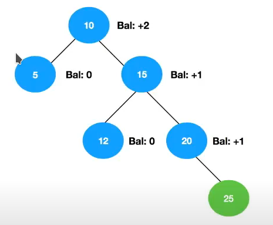

#### Explique a diferença de uma árvore binária balanceada e de uma árvore binária não balanceada e quais estratégias podem ser utilizadas para balancear uma árvore binária

##### Árvore desbalanceada
 > aquela em que a altura das sub-árvores é maior que 1.
##### Árvore Balanceada
> Quando a diferença de altura das sub-árvores é no máximo 1.

##### Estratégia de Balanceamento

Balanceaento é feito calculando o fator de balanceamento que indica  se um nó nó da árvore tem filhos que pendem para a esquerda (-1) direita (+1) ou estão em equilíbrio (0); 
ex    
Calculando o fator de balanceamento teriamos    

 - Rotação simples   
 caso o desbalanceamento aconteça no mesmo lado (ex: filho esquerdo )
 - Rotação Dupla